# ANÁLISE MICRODADOS ENEM 2019 DOS CANDIDADOS DO ESTADO DE PERNAMBUCO


```python
import pandas as pd
import matplotlib.pyplot as plt
import seaborn as sns
%matplotlib inline
%time
```

    Wall time: 0 ns
    


```python
caminho1 = "C:/tutorial-env/projetos/ENEM/dados_brutos/2019/microdados_enem_PE_2019.csv"
```


```python
colunas1 = ['NU_INSCRICAO', 'NU_ANO', 'NO_MUNICIPIO_RESIDENCIA',
       'SG_UF_RESIDENCIA', 'NU_IDADE', 'TP_SEXO', 'TP_ESTADO_CIVIL',
       'TP_COR_RACA', 'TP_NACIONALIDADE', 'TP_ST_CONCLUSAO', 'TP_ANO_CONCLUIU',
       'TP_ESCOLA', 'TP_ENSINO', 'IN_TREINEIRO', 'CO_ESCOLA',
       'NO_MUNICIPIO_ESC', 'SG_UF_ESC', 'TP_DEPENDENCIA_ADM_ESC',
       'TP_LOCALIZACAO_ESC', 'TP_SIT_FUNC_ESC', 'IN_GESTANTE', 'IN_LACTANTE',
       'IN_IDOSO', 'IN_ESTUDA_CLASSE_HOSPITALAR', 'IN_NOME_SOCIAL',
       'NO_MUNICIPIO_PROVA', 'SG_UF_PROVA', 'TP_PRESENCA_CN', 'TP_PRESENCA_CH',
       'TP_PRESENCA_LC', 'TP_PRESENCA_MT', 'CO_PROVA_CN', 'CO_PROVA_CH',
       'CO_PROVA_LC', 'CO_PROVA_MT', 'NU_NOTA_CN', 'NU_NOTA_CH', 'NU_NOTA_LC',
       'NU_NOTA_MT', 'TP_LINGUA', 'TX_GABARITO_CN', 'TX_GABARITO_CH',
       'TX_GABARITO_LC', 'TX_GABARITO_MT', 'TP_STATUS_REDACAO',
       'NU_NOTA_COMP1', 'NU_NOTA_COMP2', 'NU_NOTA_COMP3', 'NU_NOTA_COMP4',
       'NU_NOTA_COMP5', 'NU_NOTA_REDACAO', 'Q001', 'Q002', 'Q003', 'Q004',
       'Q005', 'Q006', 'Q007', 'Q008', 'Q009', 'Q010', 'Q011', 'Q012', 'Q013',
       'Q014', 'Q015', 'Q016', 'Q017', 'Q018', 'Q019', 'Q020', 'Q021', 'Q022',
       'Q023', 'Q024', 'Q025']
```


```python
microdados_pe = pd.read_csv(caminho1, sep=',', usecols=colunas1, encoding='ISO-8859-1')
%time
```

    Wall time: 0 ns
    


```python
pd.set_option('display.max.columns', None)
```


```python
microdados_pe.head()
```


<div>
<style scoped>
    .dataframe tbody tr th:only-of-type {
        vertical-align: middle;
    }

    .dataframe tbody tr th {
        vertical-align: top;
    }

    .dataframe thead th {
        text-align: right;
    }
</style>
<table border="1" class="dataframe">
  <thead>
    <tr style="text-align: right;">
      <th></th>
      <th>NU_INSCRICAO</th>
      <th>NU_ANO</th>
      <th>NO_MUNICIPIO_RESIDENCIA</th>
      <th>SG_UF_RESIDENCIA</th>
      <th>NU_IDADE</th>
      <th>TP_SEXO</th>
      <th>TP_ESTADO_CIVIL</th>
      <th>TP_COR_RACA</th>
      <th>TP_NACIONALIDADE</th>
      <th>TP_ST_CONCLUSAO</th>
      <th>TP_ANO_CONCLUIU</th>
      <th>TP_ESCOLA</th>
      <th>TP_ENSINO</th>
      <th>IN_TREINEIRO</th>
      <th>CO_ESCOLA</th>
      <th>NO_MUNICIPIO_ESC</th>
      <th>SG_UF_ESC</th>
      <th>TP_DEPENDENCIA_ADM_ESC</th>
      <th>TP_LOCALIZACAO_ESC</th>
      <th>TP_SIT_FUNC_ESC</th>
      <th>IN_GESTANTE</th>
      <th>IN_LACTANTE</th>
      <th>IN_IDOSO</th>
      <th>IN_ESTUDA_CLASSE_HOSPITALAR</th>
      <th>IN_NOME_SOCIAL</th>
      <th>NO_MUNICIPIO_PROVA</th>
      <th>SG_UF_PROVA</th>
      <th>TP_PRESENCA_CN</th>
      <th>TP_PRESENCA_CH</th>
      <th>TP_PRESENCA_LC</th>
      <th>TP_PRESENCA_MT</th>
      <th>CO_PROVA_CN</th>
      <th>CO_PROVA_CH</th>
      <th>CO_PROVA_LC</th>
      <th>CO_PROVA_MT</th>
      <th>NU_NOTA_CN</th>
      <th>NU_NOTA_CH</th>
      <th>NU_NOTA_LC</th>
      <th>NU_NOTA_MT</th>
      <th>TP_LINGUA</th>
      <th>TX_GABARITO_CN</th>
      <th>TX_GABARITO_CH</th>
      <th>TX_GABARITO_LC</th>
      <th>TX_GABARITO_MT</th>
      <th>TP_STATUS_REDACAO</th>
      <th>NU_NOTA_COMP1</th>
      <th>NU_NOTA_COMP2</th>
      <th>NU_NOTA_COMP3</th>
      <th>NU_NOTA_COMP4</th>
      <th>NU_NOTA_COMP5</th>
      <th>NU_NOTA_REDACAO</th>
      <th>Q001</th>
      <th>Q002</th>
      <th>Q003</th>
      <th>Q004</th>
      <th>Q005</th>
      <th>Q006</th>
      <th>Q007</th>
      <th>Q008</th>
      <th>Q009</th>
      <th>Q010</th>
      <th>Q011</th>
      <th>Q012</th>
      <th>Q013</th>
      <th>Q014</th>
      <th>Q015</th>
      <th>Q016</th>
      <th>Q017</th>
      <th>Q018</th>
      <th>Q019</th>
      <th>Q020</th>
      <th>Q021</th>
      <th>Q022</th>
      <th>Q023</th>
      <th>Q024</th>
      <th>Q025</th>
    </tr>
  </thead>
  <tbody>
    <tr>
      <th>0</th>
      <td>190001044305</td>
      <td>2019</td>
      <td>Palmares</td>
      <td>PE</td>
      <td>21</td>
      <td>F</td>
      <td>0</td>
      <td>0</td>
      <td>1</td>
      <td>1</td>
      <td>4</td>
      <td>1</td>
      <td>1.0</td>
      <td>0</td>
      <td>NaN</td>
      <td>NaN</td>
      <td>NaN</td>
      <td>NaN</td>
      <td>NaN</td>
      <td>NaN</td>
      <td>0</td>
      <td>0</td>
      <td>0</td>
      <td>0</td>
      <td>0</td>
      <td>Manaus</td>
      <td>AM</td>
      <td>1</td>
      <td>1</td>
      <td>1</td>
      <td>1</td>
      <td>503.0</td>
      <td>509.0</td>
      <td>514.0</td>
      <td>515.0</td>
      <td>619.6</td>
      <td>674.7</td>
      <td>629.1</td>
      <td>705.7</td>
      <td>0</td>
      <td>AAECACDEADCBCDDDBCBDADAEABCEBABEEBCBEECEBDADC</td>
      <td>ACACEEBCCBABADBBBACDBBACCCCADCEBADCBEEDBBEADB</td>
      <td>EBBADCABDABACBCEBDEEAAADDBECDECDDBADBCDAAECBCC...</td>
      <td>EEEADBEBACABCDBABECECACDCBDCCEDCDABEDECDDDBAA</td>
      <td>1.0</td>
      <td>200.0</td>
      <td>200.0</td>
      <td>160.0</td>
      <td>160.0</td>
      <td>160.0</td>
      <td>880.0</td>
      <td>E</td>
      <td>H</td>
      <td>F</td>
      <td>F</td>
      <td>6</td>
      <td>E</td>
      <td>A</td>
      <td>D</td>
      <td>E</td>
      <td>B</td>
      <td>A</td>
      <td>B</td>
      <td>B</td>
      <td>B</td>
      <td>A</td>
      <td>B</td>
      <td>A</td>
      <td>A</td>
      <td>C</td>
      <td>A</td>
      <td>A</td>
      <td>E</td>
      <td>A</td>
      <td>C</td>
      <td>B</td>
    </tr>
    <tr>
      <th>1</th>
      <td>190001051159</td>
      <td>2019</td>
      <td>Carpina</td>
      <td>PE</td>
      <td>28</td>
      <td>M</td>
      <td>1</td>
      <td>2</td>
      <td>1</td>
      <td>1</td>
      <td>6</td>
      <td>1</td>
      <td>NaN</td>
      <td>0</td>
      <td>NaN</td>
      <td>NaN</td>
      <td>NaN</td>
      <td>NaN</td>
      <td>NaN</td>
      <td>NaN</td>
      <td>0</td>
      <td>0</td>
      <td>0</td>
      <td>0</td>
      <td>0</td>
      <td>Belém</td>
      <td>PA</td>
      <td>0</td>
      <td>0</td>
      <td>0</td>
      <td>0</td>
      <td>NaN</td>
      <td>NaN</td>
      <td>NaN</td>
      <td>NaN</td>
      <td>NaN</td>
      <td>NaN</td>
      <td>NaN</td>
      <td>NaN</td>
      <td>1</td>
      <td>NaN</td>
      <td>NaN</td>
      <td>NaN</td>
      <td>NaN</td>
      <td>NaN</td>
      <td>NaN</td>
      <td>NaN</td>
      <td>NaN</td>
      <td>NaN</td>
      <td>NaN</td>
      <td>NaN</td>
      <td>C</td>
      <td>D</td>
      <td>C</td>
      <td>B</td>
      <td>1</td>
      <td>A</td>
      <td>A</td>
      <td>B</td>
      <td>A</td>
      <td>A</td>
      <td>A</td>
      <td>A</td>
      <td>A</td>
      <td>A</td>
      <td>A</td>
      <td>A</td>
      <td>A</td>
      <td>A</td>
      <td>A</td>
      <td>A</td>
      <td>A</td>
      <td>A</td>
      <td>A</td>
      <td>A</td>
      <td>A</td>
    </tr>
    <tr>
      <th>2</th>
      <td>190001058610</td>
      <td>2019</td>
      <td>Sertânia</td>
      <td>PE</td>
      <td>26</td>
      <td>M</td>
      <td>1</td>
      <td>3</td>
      <td>1</td>
      <td>1</td>
      <td>4</td>
      <td>1</td>
      <td>NaN</td>
      <td>0</td>
      <td>NaN</td>
      <td>NaN</td>
      <td>NaN</td>
      <td>NaN</td>
      <td>NaN</td>
      <td>NaN</td>
      <td>0</td>
      <td>0</td>
      <td>0</td>
      <td>0</td>
      <td>0</td>
      <td>Belém</td>
      <td>PA</td>
      <td>0</td>
      <td>0</td>
      <td>0</td>
      <td>0</td>
      <td>NaN</td>
      <td>NaN</td>
      <td>NaN</td>
      <td>NaN</td>
      <td>NaN</td>
      <td>NaN</td>
      <td>NaN</td>
      <td>NaN</td>
      <td>0</td>
      <td>NaN</td>
      <td>NaN</td>
      <td>NaN</td>
      <td>NaN</td>
      <td>NaN</td>
      <td>NaN</td>
      <td>NaN</td>
      <td>NaN</td>
      <td>NaN</td>
      <td>NaN</td>
      <td>NaN</td>
      <td>F</td>
      <td>F</td>
      <td>E</td>
      <td>D</td>
      <td>4</td>
      <td>G</td>
      <td>A</td>
      <td>B</td>
      <td>C</td>
      <td>B</td>
      <td>A</td>
      <td>B</td>
      <td>A</td>
      <td>A</td>
      <td>A</td>
      <td>B</td>
      <td>A</td>
      <td>A</td>
      <td>B</td>
      <td>A</td>
      <td>A</td>
      <td>D</td>
      <td>A</td>
      <td>B</td>
      <td>B</td>
    </tr>
    <tr>
      <th>3</th>
      <td>190001070444</td>
      <td>2019</td>
      <td>Passira</td>
      <td>PE</td>
      <td>33</td>
      <td>F</td>
      <td>1</td>
      <td>1</td>
      <td>0</td>
      <td>1</td>
      <td>13</td>
      <td>1</td>
      <td>1.0</td>
      <td>0</td>
      <td>NaN</td>
      <td>NaN</td>
      <td>NaN</td>
      <td>NaN</td>
      <td>NaN</td>
      <td>NaN</td>
      <td>0</td>
      <td>0</td>
      <td>0</td>
      <td>0</td>
      <td>0</td>
      <td>Anori</td>
      <td>AM</td>
      <td>0</td>
      <td>0</td>
      <td>0</td>
      <td>0</td>
      <td>NaN</td>
      <td>NaN</td>
      <td>NaN</td>
      <td>NaN</td>
      <td>NaN</td>
      <td>NaN</td>
      <td>NaN</td>
      <td>NaN</td>
      <td>0</td>
      <td>NaN</td>
      <td>NaN</td>
      <td>NaN</td>
      <td>NaN</td>
      <td>NaN</td>
      <td>NaN</td>
      <td>NaN</td>
      <td>NaN</td>
      <td>NaN</td>
      <td>NaN</td>
      <td>NaN</td>
      <td>G</td>
      <td>G</td>
      <td>E</td>
      <td>D</td>
      <td>5</td>
      <td>J</td>
      <td>D</td>
      <td>D</td>
      <td>E</td>
      <td>C</td>
      <td>C</td>
      <td>D</td>
      <td>B</td>
      <td>C</td>
      <td>B</td>
      <td>C</td>
      <td>B</td>
      <td>B</td>
      <td>E</td>
      <td>B</td>
      <td>B</td>
      <td>E</td>
      <td>B</td>
      <td>E</td>
      <td>B</td>
    </tr>
    <tr>
      <th>4</th>
      <td>190001087987</td>
      <td>2019</td>
      <td>Paulista</td>
      <td>PE</td>
      <td>34</td>
      <td>F</td>
      <td>1</td>
      <td>3</td>
      <td>1</td>
      <td>1</td>
      <td>13</td>
      <td>1</td>
      <td>NaN</td>
      <td>0</td>
      <td>NaN</td>
      <td>NaN</td>
      <td>NaN</td>
      <td>NaN</td>
      <td>NaN</td>
      <td>NaN</td>
      <td>0</td>
      <td>0</td>
      <td>0</td>
      <td>0</td>
      <td>0</td>
      <td>Paulista</td>
      <td>PE</td>
      <td>0</td>
      <td>0</td>
      <td>0</td>
      <td>0</td>
      <td>NaN</td>
      <td>NaN</td>
      <td>NaN</td>
      <td>NaN</td>
      <td>NaN</td>
      <td>NaN</td>
      <td>NaN</td>
      <td>NaN</td>
      <td>1</td>
      <td>NaN</td>
      <td>NaN</td>
      <td>NaN</td>
      <td>NaN</td>
      <td>NaN</td>
      <td>NaN</td>
      <td>NaN</td>
      <td>NaN</td>
      <td>NaN</td>
      <td>NaN</td>
      <td>NaN</td>
      <td>B</td>
      <td>D</td>
      <td>C</td>
      <td>B</td>
      <td>3</td>
      <td>B</td>
      <td>A</td>
      <td>B</td>
      <td>B</td>
      <td>A</td>
      <td>A</td>
      <td>B</td>
      <td>A</td>
      <td>A</td>
      <td>A</td>
      <td>A</td>
      <td>A</td>
      <td>A</td>
      <td>B</td>
      <td>A</td>
      <td>A</td>
      <td>B</td>
      <td>A</td>
      <td>A</td>
      <td>A</td>
    </tr>
  </tbody>
</table>
</div>


```python
microdados_pe.tail()
```


<div>
<style scoped>
    .dataframe tbody tr th:only-of-type {
        vertical-align: middle;
    }

    .dataframe tbody tr th {
        vertical-align: top;
    }

    .dataframe thead th {
        text-align: right;
    }
</style>
<table border="1" class="dataframe">
  <thead>
    <tr style="text-align: right;">
      <th></th>
      <th>NU_INSCRICAO</th>
      <th>NU_ANO</th>
      <th>NO_MUNICIPIO_RESIDENCIA</th>
      <th>SG_UF_RESIDENCIA</th>
      <th>NU_IDADE</th>
      <th>TP_SEXO</th>
      <th>TP_ESTADO_CIVIL</th>
      <th>TP_COR_RACA</th>
      <th>TP_NACIONALIDADE</th>
      <th>TP_ST_CONCLUSAO</th>
      <th>TP_ANO_CONCLUIU</th>
      <th>TP_ESCOLA</th>
      <th>TP_ENSINO</th>
      <th>IN_TREINEIRO</th>
      <th>CO_ESCOLA</th>
      <th>NO_MUNICIPIO_ESC</th>
      <th>SG_UF_ESC</th>
      <th>TP_DEPENDENCIA_ADM_ESC</th>
      <th>TP_LOCALIZACAO_ESC</th>
      <th>TP_SIT_FUNC_ESC</th>
      <th>IN_GESTANTE</th>
      <th>IN_LACTANTE</th>
      <th>IN_IDOSO</th>
      <th>IN_ESTUDA_CLASSE_HOSPITALAR</th>
      <th>IN_NOME_SOCIAL</th>
      <th>NO_MUNICIPIO_PROVA</th>
      <th>SG_UF_PROVA</th>
      <th>TP_PRESENCA_CN</th>
      <th>TP_PRESENCA_CH</th>
      <th>TP_PRESENCA_LC</th>
      <th>TP_PRESENCA_MT</th>
      <th>CO_PROVA_CN</th>
      <th>CO_PROVA_CH</th>
      <th>CO_PROVA_LC</th>
      <th>CO_PROVA_MT</th>
      <th>NU_NOTA_CN</th>
      <th>NU_NOTA_CH</th>
      <th>NU_NOTA_LC</th>
      <th>NU_NOTA_MT</th>
      <th>TP_LINGUA</th>
      <th>TX_GABARITO_CN</th>
      <th>TX_GABARITO_CH</th>
      <th>TX_GABARITO_LC</th>
      <th>TX_GABARITO_MT</th>
      <th>TP_STATUS_REDACAO</th>
      <th>NU_NOTA_COMP1</th>
      <th>NU_NOTA_COMP2</th>
      <th>NU_NOTA_COMP3</th>
      <th>NU_NOTA_COMP4</th>
      <th>NU_NOTA_COMP5</th>
      <th>NU_NOTA_REDACAO</th>
      <th>Q001</th>
      <th>Q002</th>
      <th>Q003</th>
      <th>Q004</th>
      <th>Q005</th>
      <th>Q006</th>
      <th>Q007</th>
      <th>Q008</th>
      <th>Q009</th>
      <th>Q010</th>
      <th>Q011</th>
      <th>Q012</th>
      <th>Q013</th>
      <th>Q014</th>
      <th>Q015</th>
      <th>Q016</th>
      <th>Q017</th>
      <th>Q018</th>
      <th>Q019</th>
      <th>Q020</th>
      <th>Q021</th>
      <th>Q022</th>
      <th>Q023</th>
      <th>Q024</th>
      <th>Q025</th>
    </tr>
  </thead>
  <tbody>
    <tr>
      <th>271722</th>
      <td>190006119912</td>
      <td>2019</td>
      <td>Calumbi</td>
      <td>PE</td>
      <td>21</td>
      <td>M</td>
      <td>1</td>
      <td>1</td>
      <td>1</td>
      <td>1</td>
      <td>4</td>
      <td>1</td>
      <td>1.0</td>
      <td>0</td>
      <td>NaN</td>
      <td>NaN</td>
      <td>NaN</td>
      <td>NaN</td>
      <td>NaN</td>
      <td>NaN</td>
      <td>0</td>
      <td>0</td>
      <td>0</td>
      <td>0</td>
      <td>0</td>
      <td>Serra Talhada</td>
      <td>PE</td>
      <td>0</td>
      <td>0</td>
      <td>0</td>
      <td>0</td>
      <td>NaN</td>
      <td>NaN</td>
      <td>NaN</td>
      <td>NaN</td>
      <td>NaN</td>
      <td>NaN</td>
      <td>NaN</td>
      <td>NaN</td>
      <td>1</td>
      <td>NaN</td>
      <td>NaN</td>
      <td>NaN</td>
      <td>NaN</td>
      <td>NaN</td>
      <td>NaN</td>
      <td>NaN</td>
      <td>NaN</td>
      <td>NaN</td>
      <td>NaN</td>
      <td>NaN</td>
      <td>D</td>
      <td>E</td>
      <td>B</td>
      <td>B</td>
      <td>3</td>
      <td>C</td>
      <td>A</td>
      <td>B</td>
      <td>C</td>
      <td>A</td>
      <td>A</td>
      <td>B</td>
      <td>A</td>
      <td>A</td>
      <td>A</td>
      <td>A</td>
      <td>A</td>
      <td>A</td>
      <td>B</td>
      <td>B</td>
      <td>A</td>
      <td>D</td>
      <td>A</td>
      <td>A</td>
      <td>B</td>
    </tr>
    <tr>
      <th>271723</th>
      <td>190006119913</td>
      <td>2019</td>
      <td>Ipojuca</td>
      <td>PE</td>
      <td>24</td>
      <td>M</td>
      <td>1</td>
      <td>0</td>
      <td>1</td>
      <td>1</td>
      <td>6</td>
      <td>1</td>
      <td>NaN</td>
      <td>0</td>
      <td>NaN</td>
      <td>NaN</td>
      <td>NaN</td>
      <td>NaN</td>
      <td>NaN</td>
      <td>NaN</td>
      <td>0</td>
      <td>0</td>
      <td>0</td>
      <td>0</td>
      <td>0</td>
      <td>Ipojuca</td>
      <td>PE</td>
      <td>0</td>
      <td>0</td>
      <td>0</td>
      <td>0</td>
      <td>NaN</td>
      <td>NaN</td>
      <td>NaN</td>
      <td>NaN</td>
      <td>NaN</td>
      <td>NaN</td>
      <td>NaN</td>
      <td>NaN</td>
      <td>1</td>
      <td>NaN</td>
      <td>NaN</td>
      <td>NaN</td>
      <td>NaN</td>
      <td>NaN</td>
      <td>NaN</td>
      <td>NaN</td>
      <td>NaN</td>
      <td>NaN</td>
      <td>NaN</td>
      <td>NaN</td>
      <td>A</td>
      <td>A</td>
      <td>A</td>
      <td>A</td>
      <td>3</td>
      <td>C</td>
      <td>A</td>
      <td>C</td>
      <td>C</td>
      <td>B</td>
      <td>A</td>
      <td>B</td>
      <td>A</td>
      <td>B</td>
      <td>A</td>
      <td>A</td>
      <td>A</td>
      <td>A</td>
      <td>B</td>
      <td>A</td>
      <td>A</td>
      <td>D</td>
      <td>A</td>
      <td>A</td>
      <td>B</td>
    </tr>
    <tr>
      <th>271724</th>
      <td>190006119914</td>
      <td>2019</td>
      <td>Afogados da Ingazeira</td>
      <td>PE</td>
      <td>21</td>
      <td>F</td>
      <td>2</td>
      <td>1</td>
      <td>1</td>
      <td>1</td>
      <td>5</td>
      <td>1</td>
      <td>NaN</td>
      <td>0</td>
      <td>NaN</td>
      <td>NaN</td>
      <td>NaN</td>
      <td>NaN</td>
      <td>NaN</td>
      <td>NaN</td>
      <td>0</td>
      <td>0</td>
      <td>0</td>
      <td>0</td>
      <td>0</td>
      <td>Afogados da Ingazeira</td>
      <td>PE</td>
      <td>1</td>
      <td>1</td>
      <td>1</td>
      <td>1</td>
      <td>503.0</td>
      <td>507.0</td>
      <td>511.0</td>
      <td>515.0</td>
      <td>519.4</td>
      <td>513.3</td>
      <td>569.3</td>
      <td>508.5</td>
      <td>1</td>
      <td>AAECACDEADCBCDDDBCBDADAEABCEBABEEBCBEECEBDADC</td>
      <td>BACCCBABBADCBCEEEBCACACEEDBCCADBEADBADBBBACDB</td>
      <td>BDABEABCADBCBAADDBECDAAECDAECBECBCCDEEAAADDBBC...</td>
      <td>EEEADBEBACABCDBABECECACDCBDCCEDCDABEDECDDDBAA</td>
      <td>1.0</td>
      <td>120.0</td>
      <td>120.0</td>
      <td>120.0</td>
      <td>180.0</td>
      <td>160.0</td>
      <td>700.0</td>
      <td>C</td>
      <td>F</td>
      <td>A</td>
      <td>D</td>
      <td>8</td>
      <td>E</td>
      <td>A</td>
      <td>C</td>
      <td>D</td>
      <td>B</td>
      <td>B</td>
      <td>B</td>
      <td>A</td>
      <td>B</td>
      <td>A</td>
      <td>B</td>
      <td>A</td>
      <td>A</td>
      <td>B</td>
      <td>A</td>
      <td>A</td>
      <td>D</td>
      <td>A</td>
      <td>A</td>
      <td>B</td>
    </tr>
    <tr>
      <th>271725</th>
      <td>190006119915</td>
      <td>2019</td>
      <td>Recife</td>
      <td>PE</td>
      <td>44</td>
      <td>F</td>
      <td>1</td>
      <td>1</td>
      <td>1</td>
      <td>1</td>
      <td>8</td>
      <td>1</td>
      <td>NaN</td>
      <td>0</td>
      <td>NaN</td>
      <td>NaN</td>
      <td>NaN</td>
      <td>NaN</td>
      <td>NaN</td>
      <td>NaN</td>
      <td>0</td>
      <td>0</td>
      <td>0</td>
      <td>0</td>
      <td>0</td>
      <td>Recife</td>
      <td>PE</td>
      <td>1</td>
      <td>1</td>
      <td>1</td>
      <td>1</td>
      <td>504.0</td>
      <td>507.0</td>
      <td>511.0</td>
      <td>516.0</td>
      <td>403.0</td>
      <td>538.7</td>
      <td>533.9</td>
      <td>395.2</td>
      <td>1</td>
      <td>BEEAAEBEEBADEADDADAEABCEDDDBCBCBCCACBCDADCCEB</td>
      <td>BACCCBABBADCBCEEEBCACACEEDBCCADBEADBADBBBACDB</td>
      <td>BDABEABCADBCBAADDBECDAAECDAECBECBCCDEEAAADDBBC...</td>
      <td>BEDEEEAADBEBACABCDBABECECACADCBDCCEDCDABECDDD</td>
      <td>1.0</td>
      <td>120.0</td>
      <td>120.0</td>
      <td>120.0</td>
      <td>80.0</td>
      <td>120.0</td>
      <td>560.0</td>
      <td>A</td>
      <td>A</td>
      <td>B</td>
      <td>B</td>
      <td>3</td>
      <td>B</td>
      <td>A</td>
      <td>B</td>
      <td>B</td>
      <td>A</td>
      <td>A</td>
      <td>B</td>
      <td>A</td>
      <td>A</td>
      <td>A</td>
      <td>A</td>
      <td>A</td>
      <td>A</td>
      <td>B</td>
      <td>A</td>
      <td>A</td>
      <td>B</td>
      <td>A</td>
      <td>A</td>
      <td>A</td>
    </tr>
    <tr>
      <th>271726</th>
      <td>190006119916</td>
      <td>2019</td>
      <td>Olinda</td>
      <td>PE</td>
      <td>19</td>
      <td>F</td>
      <td>1</td>
      <td>3</td>
      <td>1</td>
      <td>1</td>
      <td>3</td>
      <td>1</td>
      <td>1.0</td>
      <td>0</td>
      <td>NaN</td>
      <td>NaN</td>
      <td>NaN</td>
      <td>NaN</td>
      <td>NaN</td>
      <td>NaN</td>
      <td>0</td>
      <td>0</td>
      <td>0</td>
      <td>0</td>
      <td>0</td>
      <td>Olinda</td>
      <td>PE</td>
      <td>1</td>
      <td>1</td>
      <td>1</td>
      <td>1</td>
      <td>505.0</td>
      <td>509.0</td>
      <td>514.0</td>
      <td>518.0</td>
      <td>499.9</td>
      <td>580.5</td>
      <td>547.5</td>
      <td>478.2</td>
      <td>1</td>
      <td>DADCCEBBCCACBEEBEEBACBCDDDDADBCBBCEAEADEADAAE</td>
      <td>ACACEEBCCBABADBBBACDBBACCCCADCEBADCBEEDBBEADB</td>
      <td>EBBADCABDABACBCEBDEEAAADDBECDECDDBADBCDAAECBCC...</td>
      <td>DBEBACABCDBABECEEEDCBDCCEDCDABEDAADDDECACAECB</td>
      <td>1.0</td>
      <td>160.0</td>
      <td>200.0</td>
      <td>160.0</td>
      <td>200.0</td>
      <td>160.0</td>
      <td>880.0</td>
      <td>A</td>
      <td>B</td>
      <td>C</td>
      <td>B</td>
      <td>5</td>
      <td>E</td>
      <td>A</td>
      <td>B</td>
      <td>D</td>
      <td>B</td>
      <td>A</td>
      <td>B</td>
      <td>B</td>
      <td>B</td>
      <td>A</td>
      <td>B</td>
      <td>A</td>
      <td>A</td>
      <td>B</td>
      <td>A</td>
      <td>B</td>
      <td>D</td>
      <td>B</td>
      <td>B</td>
      <td>B</td>
    </tr>
  </tbody>
</table>
</div>


```python
# Variável 'TP_DEPENDENCIA_ADM_ESC':
# 1=Federal
# 2=Estadual
# 3=Municipal
# 4=Privada
escolas_publicas_pe = microdados_pe[microdados_pe['TP_ESCOLA']==2]

# Variável 'TP_ESCOLA':
# 1=Não respondeu;
# 2=Pública;
# 3=Privada;
# 4=Exterior

```


```python
escolas_publicas_pe.head()
```


<div>
<style scoped>
    .dataframe tbody tr th:only-of-type {
        vertical-align: middle;
    }

    .dataframe tbody tr th {
        vertical-align: top;
    }

    .dataframe thead th {
        text-align: right;
    }
</style>
<table border="1" class="dataframe">
  <thead>
    <tr style="text-align: right;">
      <th></th>
      <th>NU_INSCRICAO</th>
      <th>NU_ANO</th>
      <th>NO_MUNICIPIO_RESIDENCIA</th>
      <th>SG_UF_RESIDENCIA</th>
      <th>NU_IDADE</th>
      <th>TP_SEXO</th>
      <th>TP_ESTADO_CIVIL</th>
      <th>TP_COR_RACA</th>
      <th>TP_NACIONALIDADE</th>
      <th>TP_ST_CONCLUSAO</th>
      <th>TP_ANO_CONCLUIU</th>
      <th>TP_ESCOLA</th>
      <th>TP_ENSINO</th>
      <th>IN_TREINEIRO</th>
      <th>CO_ESCOLA</th>
      <th>NO_MUNICIPIO_ESC</th>
      <th>SG_UF_ESC</th>
      <th>TP_DEPENDENCIA_ADM_ESC</th>
      <th>TP_LOCALIZACAO_ESC</th>
      <th>TP_SIT_FUNC_ESC</th>
      <th>IN_GESTANTE</th>
      <th>IN_LACTANTE</th>
      <th>IN_IDOSO</th>
      <th>IN_ESTUDA_CLASSE_HOSPITALAR</th>
      <th>IN_NOME_SOCIAL</th>
      <th>NO_MUNICIPIO_PROVA</th>
      <th>SG_UF_PROVA</th>
      <th>TP_PRESENCA_CN</th>
      <th>TP_PRESENCA_CH</th>
      <th>TP_PRESENCA_LC</th>
      <th>TP_PRESENCA_MT</th>
      <th>CO_PROVA_CN</th>
      <th>CO_PROVA_CH</th>
      <th>CO_PROVA_LC</th>
      <th>CO_PROVA_MT</th>
      <th>NU_NOTA_CN</th>
      <th>NU_NOTA_CH</th>
      <th>NU_NOTA_LC</th>
      <th>NU_NOTA_MT</th>
      <th>TP_LINGUA</th>
      <th>TX_GABARITO_CN</th>
      <th>TX_GABARITO_CH</th>
      <th>TX_GABARITO_LC</th>
      <th>TX_GABARITO_MT</th>
      <th>TP_STATUS_REDACAO</th>
      <th>NU_NOTA_COMP1</th>
      <th>NU_NOTA_COMP2</th>
      <th>NU_NOTA_COMP3</th>
      <th>NU_NOTA_COMP4</th>
      <th>NU_NOTA_COMP5</th>
      <th>NU_NOTA_REDACAO</th>
      <th>Q001</th>
      <th>Q002</th>
      <th>Q003</th>
      <th>Q004</th>
      <th>Q005</th>
      <th>Q006</th>
      <th>Q007</th>
      <th>Q008</th>
      <th>Q009</th>
      <th>Q010</th>
      <th>Q011</th>
      <th>Q012</th>
      <th>Q013</th>
      <th>Q014</th>
      <th>Q015</th>
      <th>Q016</th>
      <th>Q017</th>
      <th>Q018</th>
      <th>Q019</th>
      <th>Q020</th>
      <th>Q021</th>
      <th>Q022</th>
      <th>Q023</th>
      <th>Q024</th>
      <th>Q025</th>
    </tr>
  </thead>
  <tbody>
    <tr>
      <th>21</th>
      <td>190001139625</td>
      <td>2019</td>
      <td>Cedro</td>
      <td>PE</td>
      <td>18</td>
      <td>M</td>
      <td>1</td>
      <td>3</td>
      <td>1</td>
      <td>2</td>
      <td>0</td>
      <td>2</td>
      <td>1.0</td>
      <td>0</td>
      <td>23244666.0</td>
      <td>Jardim</td>
      <td>CE</td>
      <td>2.0</td>
      <td>2.0</td>
      <td>1.0</td>
      <td>0</td>
      <td>0</td>
      <td>0</td>
      <td>0</td>
      <td>0</td>
      <td>Jardim</td>
      <td>CE</td>
      <td>1</td>
      <td>1</td>
      <td>1</td>
      <td>1</td>
      <td>505.0</td>
      <td>508.0</td>
      <td>512.0</td>
      <td>518.0</td>
      <td>431.4</td>
      <td>470.9</td>
      <td>519.0</td>
      <td>556.7</td>
      <td>1</td>
      <td>DADCCEBBCCACBEEBEEBACBCDDDDADBCBBCEAEADEADAAE</td>
      <td>CBABADBBCEEEBCBADCBEEDBBEADBBACDBBACCCCADACAC</td>
      <td>BBEDABDACACBABAECBBCCADCEBDBBCDDEEAAADDBECDECA...</td>
      <td>DBEBACABCDBABECEEEDCBDCCEDCDABEDAADDDECACAECB</td>
      <td>1.0</td>
      <td>120.0</td>
      <td>120.0</td>
      <td>120.0</td>
      <td>140.0</td>
      <td>180.0</td>
      <td>680.0</td>
      <td>C</td>
      <td>C</td>
      <td>A</td>
      <td>A</td>
      <td>5</td>
      <td>B</td>
      <td>A</td>
      <td>B</td>
      <td>C</td>
      <td>A</td>
      <td>B</td>
      <td>B</td>
      <td>A</td>
      <td>A</td>
      <td>A</td>
      <td>A</td>
      <td>A</td>
      <td>A</td>
      <td>B</td>
      <td>A</td>
      <td>A</td>
      <td>C</td>
      <td>A</td>
      <td>A</td>
      <td>A</td>
    </tr>
    <tr>
      <th>24</th>
      <td>190001140308</td>
      <td>2019</td>
      <td>Cedro</td>
      <td>PE</td>
      <td>18</td>
      <td>F</td>
      <td>1</td>
      <td>3</td>
      <td>1</td>
      <td>2</td>
      <td>0</td>
      <td>2</td>
      <td>1.0</td>
      <td>0</td>
      <td>23244666.0</td>
      <td>Jardim</td>
      <td>CE</td>
      <td>2.0</td>
      <td>2.0</td>
      <td>1.0</td>
      <td>0</td>
      <td>0</td>
      <td>0</td>
      <td>0</td>
      <td>0</td>
      <td>Jardim</td>
      <td>CE</td>
      <td>1</td>
      <td>1</td>
      <td>1</td>
      <td>1</td>
      <td>505.0</td>
      <td>508.0</td>
      <td>512.0</td>
      <td>518.0</td>
      <td>523.6</td>
      <td>536.4</td>
      <td>610.5</td>
      <td>589.7</td>
      <td>1</td>
      <td>DADCCEBBCCACBEEBEEBACBCDDDDADBCBBCEAEADEADAAE</td>
      <td>CBABADBBCEEEBCBADCBEEDBBEADBBACDBBACCCCADACAC</td>
      <td>BBEDABDACACBABAECBBCCADCEBDBBCDDEEAAADDBECDECA...</td>
      <td>DBEBACABCDBABECEEEDCBDCCEDCDABEDAADDDECACAECB</td>
      <td>1.0</td>
      <td>160.0</td>
      <td>140.0</td>
      <td>160.0</td>
      <td>140.0</td>
      <td>140.0</td>
      <td>740.0</td>
      <td>D</td>
      <td>B</td>
      <td>A</td>
      <td>A</td>
      <td>4</td>
      <td>C</td>
      <td>A</td>
      <td>B</td>
      <td>D</td>
      <td>A</td>
      <td>A</td>
      <td>B</td>
      <td>A</td>
      <td>A</td>
      <td>A</td>
      <td>A</td>
      <td>A</td>
      <td>A</td>
      <td>B</td>
      <td>A</td>
      <td>B</td>
      <td>C</td>
      <td>A</td>
      <td>A</td>
      <td>B</td>
    </tr>
    <tr>
      <th>37</th>
      <td>190001149305</td>
      <td>2019</td>
      <td>Cedro</td>
      <td>PE</td>
      <td>17</td>
      <td>F</td>
      <td>1</td>
      <td>3</td>
      <td>1</td>
      <td>2</td>
      <td>0</td>
      <td>2</td>
      <td>1.0</td>
      <td>0</td>
      <td>NaN</td>
      <td>NaN</td>
      <td>NaN</td>
      <td>NaN</td>
      <td>NaN</td>
      <td>NaN</td>
      <td>0</td>
      <td>0</td>
      <td>0</td>
      <td>0</td>
      <td>0</td>
      <td>Jardim</td>
      <td>CE</td>
      <td>1</td>
      <td>1</td>
      <td>1</td>
      <td>1</td>
      <td>503.0</td>
      <td>509.0</td>
      <td>514.0</td>
      <td>515.0</td>
      <td>353.6</td>
      <td>405.1</td>
      <td>399.0</td>
      <td>482.2</td>
      <td>0</td>
      <td>AAECACDEADCBCDDDBCBDADAEABCEBABEEBCBEECEBDADC</td>
      <td>ACACEEBCCBABADBBBACDBBACCCCADCEBADCBEEDBBEADB</td>
      <td>EBBADCABDABACBCEBDEEAAADDBECDECDDBADBCDAAECBCC...</td>
      <td>EEEADBEBACABCDBABECECACDCBDCCEDCDABEDECDDDBAA</td>
      <td>1.0</td>
      <td>100.0</td>
      <td>120.0</td>
      <td>100.0</td>
      <td>80.0</td>
      <td>100.0</td>
      <td>500.0</td>
      <td>C</td>
      <td>E</td>
      <td>F</td>
      <td>F</td>
      <td>5</td>
      <td>B</td>
      <td>A</td>
      <td>B</td>
      <td>C</td>
      <td>A</td>
      <td>B</td>
      <td>B</td>
      <td>A</td>
      <td>B</td>
      <td>A</td>
      <td>A</td>
      <td>A</td>
      <td>A</td>
      <td>B</td>
      <td>B</td>
      <td>A</td>
      <td>D</td>
      <td>A</td>
      <td>A</td>
      <td>B</td>
    </tr>
    <tr>
      <th>41</th>
      <td>190001150539</td>
      <td>2019</td>
      <td>Serrita</td>
      <td>PE</td>
      <td>16</td>
      <td>F</td>
      <td>1</td>
      <td>3</td>
      <td>1</td>
      <td>2</td>
      <td>0</td>
      <td>2</td>
      <td>1.0</td>
      <td>0</td>
      <td>26013452.0</td>
      <td>Serrita</td>
      <td>PE</td>
      <td>2.0</td>
      <td>1.0</td>
      <td>1.0</td>
      <td>0</td>
      <td>0</td>
      <td>0</td>
      <td>0</td>
      <td>0</td>
      <td>Jardim</td>
      <td>CE</td>
      <td>1</td>
      <td>1</td>
      <td>1</td>
      <td>1</td>
      <td>505.0</td>
      <td>508.0</td>
      <td>512.0</td>
      <td>518.0</td>
      <td>440.6</td>
      <td>448.1</td>
      <td>487.3</td>
      <td>446.1</td>
      <td>1</td>
      <td>DADCCEBBCCACBEEBEEBACBCDDDDADBCBBCEAEADEADAAE</td>
      <td>CBABADBBCEEEBCBADCBEEDBBEADBBACDBBACCCCADACAC</td>
      <td>BBEDABDACACBABAECBBCCADCEBDBBCDDEEAAADDBECDECA...</td>
      <td>DBEBACABCDBABECEEEDCBDCCEDCDABEDAADDDECACAECB</td>
      <td>1.0</td>
      <td>120.0</td>
      <td>100.0</td>
      <td>100.0</td>
      <td>100.0</td>
      <td>0.0</td>
      <td>420.0</td>
      <td>E</td>
      <td>F</td>
      <td>A</td>
      <td>D</td>
      <td>5</td>
      <td>C</td>
      <td>A</td>
      <td>B</td>
      <td>D</td>
      <td>A</td>
      <td>B</td>
      <td>B</td>
      <td>A</td>
      <td>B</td>
      <td>A</td>
      <td>A</td>
      <td>A</td>
      <td>A</td>
      <td>B</td>
      <td>A</td>
      <td>A</td>
      <td>B</td>
      <td>A</td>
      <td>A</td>
      <td>A</td>
    </tr>
    <tr>
      <th>50</th>
      <td>190001157832</td>
      <td>2019</td>
      <td>Cedro</td>
      <td>PE</td>
      <td>18</td>
      <td>F</td>
      <td>1</td>
      <td>2</td>
      <td>1</td>
      <td>2</td>
      <td>0</td>
      <td>2</td>
      <td>1.0</td>
      <td>0</td>
      <td>23244666.0</td>
      <td>Jardim</td>
      <td>CE</td>
      <td>2.0</td>
      <td>2.0</td>
      <td>1.0</td>
      <td>0</td>
      <td>0</td>
      <td>0</td>
      <td>0</td>
      <td>0</td>
      <td>Jardim</td>
      <td>CE</td>
      <td>1</td>
      <td>1</td>
      <td>1</td>
      <td>1</td>
      <td>506.0</td>
      <td>510.0</td>
      <td>513.0</td>
      <td>517.0</td>
      <td>451.8</td>
      <td>555.2</td>
      <td>546.2</td>
      <td>495.1</td>
      <td>0</td>
      <td>DEADBAAAEBEECEBCBCBCBDADAEABCEDDDDADCBEECACBC</td>
      <td>EEBCEEDBADBBCBABCCADCEBACDBBACCACACBEADBBADCB</td>
      <td>ADBBEDCABAABBCBCDAAECDDDBAAAECADECDCEBDEEAECBD...</td>
      <td>AADDDBEEEBEDDBEBACABCDBABECECACAECDCBDCCEDCDA</td>
      <td>1.0</td>
      <td>140.0</td>
      <td>140.0</td>
      <td>120.0</td>
      <td>140.0</td>
      <td>100.0</td>
      <td>640.0</td>
      <td>B</td>
      <td>G</td>
      <td>A</td>
      <td>D</td>
      <td>3</td>
      <td>E</td>
      <td>A</td>
      <td>B</td>
      <td>C</td>
      <td>A</td>
      <td>B</td>
      <td>B</td>
      <td>A</td>
      <td>A</td>
      <td>A</td>
      <td>B</td>
      <td>A</td>
      <td>A</td>
      <td>B</td>
      <td>A</td>
      <td>A</td>
      <td>C</td>
      <td>A</td>
      <td>A</td>
      <td>B</td>
    </tr>
  </tbody>
</table>
</div>


```python
escolas_publicas_pe['NU_IDADE'].value_counts()
```


    17    23473
    18    22952
    19     7096
    16     2755
    20     2216
    21      747
    22      387
    23      267
    24      227
    25      157
    26      140
    27      123
    28      121
    29      118
    31      107
    30      106
    32      101
    33       87
    34       84
    35       83
    36       81
    37       76
    39       71
    38       61
    41       53
    42       49
    40       47
    15       45
    47       40
    43       36
    48       29
    45       28
    46       26
    49       25
    44       21
    50       17
    55       17
    51       17
    53       13
    54       11
    57       11
    59        8
    56        8
    58        7
    60        6
    62        6
    52        5
    61        5
    66        3
    14        2
    67        2
    69        2
    10        1
    7         1
    8         1
    64        1
    63        1
    Name: NU_IDADE, dtype: int64


```python
round(escolas_publicas_pe['NU_IDADE'].mean(), 1)
```


    18.4


```python
escolas_publicas_pe['NU_IDADE'].median()
```


    18.0


```python
round(escolas_publicas_pe['NU_IDADE'].std(), 1)
```


    3.6


```python
plt.figure(figsize=(8,8))
escolas_publicas_pe['NU_IDADE'].hist(bins=17)
plt.xlabel('Idades dos participantes')
plt.ylabel('Num. de participantes')
```


    Text(0, 0.5, 'Num. de participantes')


    
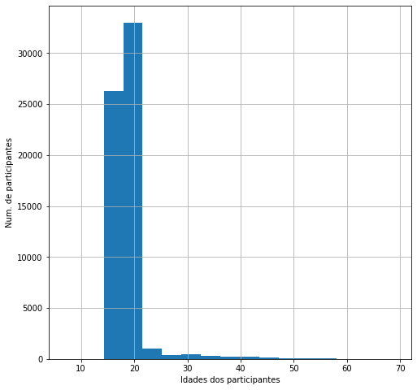
    


```python
escolas_publicas_pe['IN_TREINEIRO'].unique()
```


    array([0], dtype=int64)


```python
plt.figure(figsize=(20,10))
sns.scatterplot(x=microdados_pe['NU_NOTA_REDACAO'], y=microdados_pe['NU_NOTA_MT'], 
                hue=microdados_pe['TP_ESCOLA'])
plt.xlabel('Nota da redação')
plt.ylabel('Nota de matemática')
plt.title('Relação entre a nota da redação e a nota de matemática')

```


    Text(0.5, 1.0, 'Relação entre a nota da redação e a nota de matemática')


    
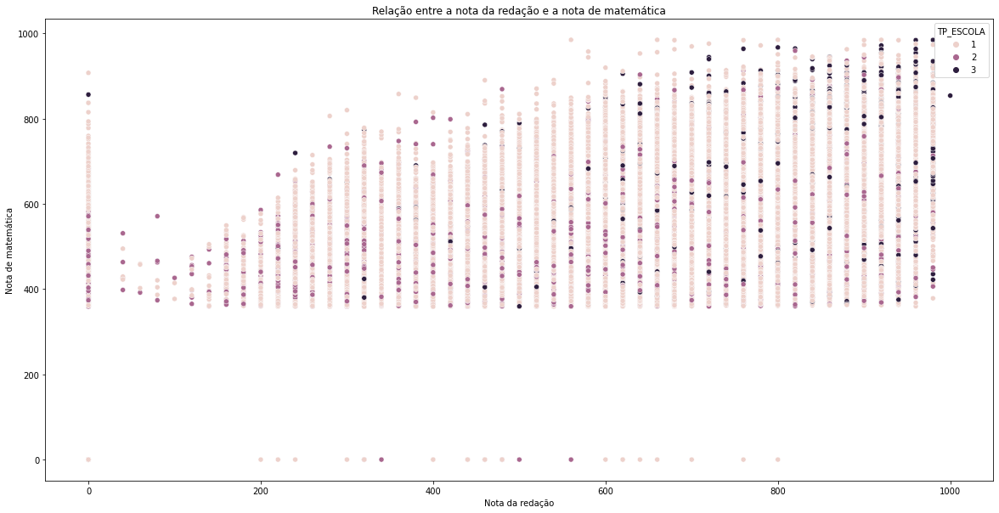
    


```python
plt.figure(figsize=(20,10))
sns.scatterplot(x=escolas_publicas_pe['NU_NOTA_REDACAO'], y=escolas_publicas_pe['NU_NOTA_MT'], 
                hue=microdados_pe['Q025'])
plt.xlabel('Nota da redação')
plt.ylabel('Nota de matemática')
plt.title('Relação entre a nota da redação e a nota de matemática para estudantes de escolas públicas')

```


    Text(0.5, 1.0, 'Relação entre a nota da redação e a nota de matemática para estudantes de escolas públicas')


    
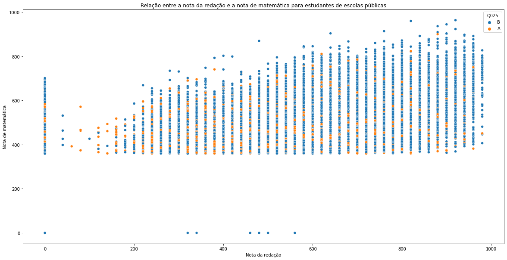
    


```python
# Análise para a ETE Luiz Alves Lacerda
micro_ete_lal = microdados_pe[microdados_pe['CO_ESCOLA']==26185768]
```


```python
micro_ete_lal.head()
```


<div>
<style scoped>
    .dataframe tbody tr th:only-of-type {
        vertical-align: middle;
    }

    .dataframe tbody tr th {
        vertical-align: top;
    }

    .dataframe thead th {
        text-align: right;
    }
</style>
<table border="1" class="dataframe">
  <thead>
    <tr style="text-align: right;">
      <th></th>
      <th>NU_INSCRICAO</th>
      <th>NU_ANO</th>
      <th>NO_MUNICIPIO_RESIDENCIA</th>
      <th>SG_UF_RESIDENCIA</th>
      <th>NU_IDADE</th>
      <th>TP_SEXO</th>
      <th>TP_ESTADO_CIVIL</th>
      <th>TP_COR_RACA</th>
      <th>TP_NACIONALIDADE</th>
      <th>TP_ST_CONCLUSAO</th>
      <th>TP_ANO_CONCLUIU</th>
      <th>TP_ESCOLA</th>
      <th>TP_ENSINO</th>
      <th>IN_TREINEIRO</th>
      <th>CO_ESCOLA</th>
      <th>NO_MUNICIPIO_ESC</th>
      <th>SG_UF_ESC</th>
      <th>TP_DEPENDENCIA_ADM_ESC</th>
      <th>TP_LOCALIZACAO_ESC</th>
      <th>TP_SIT_FUNC_ESC</th>
      <th>IN_GESTANTE</th>
      <th>IN_LACTANTE</th>
      <th>IN_IDOSO</th>
      <th>IN_ESTUDA_CLASSE_HOSPITALAR</th>
      <th>IN_NOME_SOCIAL</th>
      <th>NO_MUNICIPIO_PROVA</th>
      <th>SG_UF_PROVA</th>
      <th>TP_PRESENCA_CN</th>
      <th>TP_PRESENCA_CH</th>
      <th>TP_PRESENCA_LC</th>
      <th>TP_PRESENCA_MT</th>
      <th>CO_PROVA_CN</th>
      <th>CO_PROVA_CH</th>
      <th>CO_PROVA_LC</th>
      <th>CO_PROVA_MT</th>
      <th>NU_NOTA_CN</th>
      <th>NU_NOTA_CH</th>
      <th>NU_NOTA_LC</th>
      <th>NU_NOTA_MT</th>
      <th>TP_LINGUA</th>
      <th>TX_GABARITO_CN</th>
      <th>TX_GABARITO_CH</th>
      <th>TX_GABARITO_LC</th>
      <th>TX_GABARITO_MT</th>
      <th>TP_STATUS_REDACAO</th>
      <th>NU_NOTA_COMP1</th>
      <th>NU_NOTA_COMP2</th>
      <th>NU_NOTA_COMP3</th>
      <th>NU_NOTA_COMP4</th>
      <th>NU_NOTA_COMP5</th>
      <th>NU_NOTA_REDACAO</th>
      <th>Q001</th>
      <th>Q002</th>
      <th>Q003</th>
      <th>Q004</th>
      <th>Q005</th>
      <th>Q006</th>
      <th>Q007</th>
      <th>Q008</th>
      <th>Q009</th>
      <th>Q010</th>
      <th>Q011</th>
      <th>Q012</th>
      <th>Q013</th>
      <th>Q014</th>
      <th>Q015</th>
      <th>Q016</th>
      <th>Q017</th>
      <th>Q018</th>
      <th>Q019</th>
      <th>Q020</th>
      <th>Q021</th>
      <th>Q022</th>
      <th>Q023</th>
      <th>Q024</th>
      <th>Q025</th>
    </tr>
  </thead>
  <tbody>
    <tr>
      <th>5800</th>
      <td>190001341790</td>
      <td>2019</td>
      <td>Cabo de Santo Agostinho</td>
      <td>PE</td>
      <td>16</td>
      <td>M</td>
      <td>1</td>
      <td>1</td>
      <td>1</td>
      <td>2</td>
      <td>0</td>
      <td>2</td>
      <td>1.0</td>
      <td>0</td>
      <td>26185768.0</td>
      <td>Cabo de Santo Agostinho</td>
      <td>PE</td>
      <td>2.0</td>
      <td>1.0</td>
      <td>1.0</td>
      <td>0</td>
      <td>0</td>
      <td>0</td>
      <td>0</td>
      <td>0</td>
      <td>Cabo de Santo Agostinho</td>
      <td>PE</td>
      <td>1</td>
      <td>1</td>
      <td>1</td>
      <td>1</td>
      <td>506.0</td>
      <td>509.0</td>
      <td>514.0</td>
      <td>517.0</td>
      <td>392.5</td>
      <td>520.5</td>
      <td>533.5</td>
      <td>562.2</td>
      <td>0</td>
      <td>DEADBAAAEBEECEBCBCBCBDADAEABCEDDDDADCBEECACBC</td>
      <td>ACACEEBCCBABADBBBACDBBACCCCADCEBADCBEEDBBEADB</td>
      <td>EBBADCABDABACBCEBDEEAAADDBECDECDDBADBCDAAECBCC...</td>
      <td>AADDDBEEEBEDDBEBACABCDBABECECACAECDCBDCCEDCDA</td>
      <td>1.0</td>
      <td>120.0</td>
      <td>180.0</td>
      <td>140.0</td>
      <td>140.0</td>
      <td>140.0</td>
      <td>720.0</td>
      <td>G</td>
      <td>G</td>
      <td>D</td>
      <td>D</td>
      <td>5</td>
      <td>K</td>
      <td>A</td>
      <td>B</td>
      <td>D</td>
      <td>B</td>
      <td>B</td>
      <td>B</td>
      <td>A</td>
      <td>B</td>
      <td>A</td>
      <td>B</td>
      <td>A</td>
      <td>A</td>
      <td>B</td>
      <td>A</td>
      <td>B</td>
      <td>E</td>
      <td>A</td>
      <td>B</td>
      <td>B</td>
    </tr>
    <tr>
      <th>9701</th>
      <td>190001346038</td>
      <td>2019</td>
      <td>Cabo de Santo Agostinho</td>
      <td>PE</td>
      <td>17</td>
      <td>F</td>
      <td>0</td>
      <td>3</td>
      <td>1</td>
      <td>2</td>
      <td>0</td>
      <td>2</td>
      <td>1.0</td>
      <td>0</td>
      <td>26185768.0</td>
      <td>Cabo de Santo Agostinho</td>
      <td>PE</td>
      <td>2.0</td>
      <td>1.0</td>
      <td>1.0</td>
      <td>0</td>
      <td>0</td>
      <td>0</td>
      <td>0</td>
      <td>0</td>
      <td>Cabo de Santo Agostinho</td>
      <td>PE</td>
      <td>1</td>
      <td>1</td>
      <td>1</td>
      <td>1</td>
      <td>506.0</td>
      <td>509.0</td>
      <td>514.0</td>
      <td>517.0</td>
      <td>380.7</td>
      <td>515.9</td>
      <td>485.3</td>
      <td>447.7</td>
      <td>0</td>
      <td>DEADBAAAEBEECEBCBCBCBDADAEABCEDDDDADCBEECACBC</td>
      <td>ACACEEBCCBABADBBBACDBBACCCCADCEBADCBEEDBBEADB</td>
      <td>EBBADCABDABACBCEBDEEAAADDBECDECDDBADBCDAAECBCC...</td>
      <td>AADDDBEEEBEDDBEBACABCDBABECECACAECDCBDCCEDCDA</td>
      <td>1.0</td>
      <td>120.0</td>
      <td>120.0</td>
      <td>120.0</td>
      <td>100.0</td>
      <td>120.0</td>
      <td>580.0</td>
      <td>E</td>
      <td>E</td>
      <td>C</td>
      <td>B</td>
      <td>2</td>
      <td>C</td>
      <td>A</td>
      <td>B</td>
      <td>B</td>
      <td>A</td>
      <td>A</td>
      <td>A</td>
      <td>B</td>
      <td>B</td>
      <td>A</td>
      <td>B</td>
      <td>A</td>
      <td>A</td>
      <td>B</td>
      <td>A</td>
      <td>A</td>
      <td>C</td>
      <td>A</td>
      <td>A</td>
      <td>A</td>
    </tr>
    <tr>
      <th>10453</th>
      <td>190001347035</td>
      <td>2019</td>
      <td>Cabo de Santo Agostinho</td>
      <td>PE</td>
      <td>17</td>
      <td>M</td>
      <td>1</td>
      <td>1</td>
      <td>1</td>
      <td>2</td>
      <td>0</td>
      <td>2</td>
      <td>1.0</td>
      <td>0</td>
      <td>26185768.0</td>
      <td>Cabo de Santo Agostinho</td>
      <td>PE</td>
      <td>2.0</td>
      <td>1.0</td>
      <td>1.0</td>
      <td>0</td>
      <td>0</td>
      <td>0</td>
      <td>0</td>
      <td>0</td>
      <td>Cabo de Santo Agostinho</td>
      <td>PE</td>
      <td>1</td>
      <td>1</td>
      <td>1</td>
      <td>1</td>
      <td>503.0</td>
      <td>508.0</td>
      <td>512.0</td>
      <td>515.0</td>
      <td>432.7</td>
      <td>609.4</td>
      <td>571.1</td>
      <td>633.9</td>
      <td>1</td>
      <td>AAECACDEADCBCDDDBCBDADAEABCEBABEEBCBEECEBDADC</td>
      <td>CBABADBBCEEEBCBADCBEEDBBEADBBACDBBACCCCADACAC</td>
      <td>BBEDABDACACBABAECBBCCADCEBDBBCDDEEAAADDBECDECA...</td>
      <td>EEEADBEBACABCDBABECECACDCBDCCEDCDABEDECDDDBAA</td>
      <td>1.0</td>
      <td>120.0</td>
      <td>120.0</td>
      <td>120.0</td>
      <td>120.0</td>
      <td>160.0</td>
      <td>640.0</td>
      <td>E</td>
      <td>E</td>
      <td>C</td>
      <td>B</td>
      <td>3</td>
      <td>B</td>
      <td>A</td>
      <td>B</td>
      <td>C</td>
      <td>A</td>
      <td>A</td>
      <td>B</td>
      <td>A</td>
      <td>B</td>
      <td>A</td>
      <td>A</td>
      <td>A</td>
      <td>A</td>
      <td>B</td>
      <td>A</td>
      <td>A</td>
      <td>D</td>
      <td>A</td>
      <td>B</td>
      <td>B</td>
    </tr>
    <tr>
      <th>11108</th>
      <td>190001347752</td>
      <td>2019</td>
      <td>Recife</td>
      <td>PE</td>
      <td>19</td>
      <td>F</td>
      <td>1</td>
      <td>2</td>
      <td>1</td>
      <td>2</td>
      <td>0</td>
      <td>2</td>
      <td>1.0</td>
      <td>0</td>
      <td>26185768.0</td>
      <td>Cabo de Santo Agostinho</td>
      <td>PE</td>
      <td>2.0</td>
      <td>1.0</td>
      <td>1.0</td>
      <td>0</td>
      <td>0</td>
      <td>0</td>
      <td>0</td>
      <td>0</td>
      <td>Recife</td>
      <td>PE</td>
      <td>1</td>
      <td>1</td>
      <td>1</td>
      <td>1</td>
      <td>504.0</td>
      <td>510.0</td>
      <td>513.0</td>
      <td>516.0</td>
      <td>431.0</td>
      <td>538.9</td>
      <td>516.3</td>
      <td>385.9</td>
      <td>1</td>
      <td>BEEAAEBEEBADEADDADAEABCEDDDBCBCBCCACBCDADCCEB</td>
      <td>EEBCEEDBADBBCBABCCADCEBACDBBACCACACBEADBBADCB</td>
      <td>ADBBEDCABAABBCBCDAAECDDDBAAAECADECDCEBDEEAECBD...</td>
      <td>BEDEEEAADBEBACABCDBABECECACADCBDCCEDCDABECDDD</td>
      <td>1.0</td>
      <td>140.0</td>
      <td>160.0</td>
      <td>160.0</td>
      <td>120.0</td>
      <td>100.0</td>
      <td>680.0</td>
      <td>B</td>
      <td>E</td>
      <td>F</td>
      <td>B</td>
      <td>5</td>
      <td>B</td>
      <td>A</td>
      <td>B</td>
      <td>C</td>
      <td>A</td>
      <td>A</td>
      <td>B</td>
      <td>B</td>
      <td>A</td>
      <td>A</td>
      <td>B</td>
      <td>A</td>
      <td>A</td>
      <td>B</td>
      <td>A</td>
      <td>A</td>
      <td>C</td>
      <td>A</td>
      <td>A</td>
      <td>B</td>
    </tr>
    <tr>
      <th>12349</th>
      <td>190001349012</td>
      <td>2019</td>
      <td>Cabo de Santo Agostinho</td>
      <td>PE</td>
      <td>17</td>
      <td>F</td>
      <td>1</td>
      <td>1</td>
      <td>1</td>
      <td>2</td>
      <td>0</td>
      <td>2</td>
      <td>1.0</td>
      <td>0</td>
      <td>26185768.0</td>
      <td>Cabo de Santo Agostinho</td>
      <td>PE</td>
      <td>2.0</td>
      <td>1.0</td>
      <td>1.0</td>
      <td>0</td>
      <td>0</td>
      <td>0</td>
      <td>0</td>
      <td>0</td>
      <td>Cabo de Santo Agostinho</td>
      <td>PE</td>
      <td>1</td>
      <td>1</td>
      <td>1</td>
      <td>1</td>
      <td>505.0</td>
      <td>507.0</td>
      <td>511.0</td>
      <td>518.0</td>
      <td>365.2</td>
      <td>470.2</td>
      <td>517.6</td>
      <td>638.4</td>
      <td>1</td>
      <td>DADCCEBBCCACBEEBEEBACBCDDDDADBCBBCEAEADEADAAE</td>
      <td>BACCCBABBADCBCEEEBCACACEEDBCCADBEADBADBBBACDB</td>
      <td>BDABEABCADBCBAADDBECDAAECDAECBECBCCDEEAAADDBBC...</td>
      <td>DBEBACABCDBABECEEEDCBDCCEDCDABEDAADDDECACAECB</td>
      <td>1.0</td>
      <td>120.0</td>
      <td>120.0</td>
      <td>120.0</td>
      <td>120.0</td>
      <td>80.0</td>
      <td>560.0</td>
      <td>E</td>
      <td>E</td>
      <td>C</td>
      <td>F</td>
      <td>3</td>
      <td>B</td>
      <td>A</td>
      <td>B</td>
      <td>C</td>
      <td>A</td>
      <td>A</td>
      <td>B</td>
      <td>B</td>
      <td>A</td>
      <td>A</td>
      <td>A</td>
      <td>A</td>
      <td>A</td>
      <td>B</td>
      <td>A</td>
      <td>A</td>
      <td>D</td>
      <td>A</td>
      <td>A</td>
      <td>B</td>
    </tr>
  </tbody>
</table>
</div>


```python
idades_lal = micro_ete_lal['NU_IDADE'].value_counts()
```


```python
idades_lal
```


    17    70
    18    45
    16    25
    19     6
    20     1
    Name: NU_IDADE, dtype: int64


```python
round(micro_ete_lal['NU_IDADE'].mean(), 1)
```


    17.2


```python
plt.figure(figsize=(10,8))
sns.catplot(x=micro_ete_lal['NU_IDADE'], kind="count", data=micro_ete_lal)
plt.title("Distribuição das idades dos estudantes da ETE Luiz Alves Lacerda")
plt.xlabel("Idades")
plt.ylabel("Num. de estudantes")
```


    Text(10.049999999999997, 0.5, 'Num. de estudantes')


    <Figure size 720x576 with 0 Axes>


    
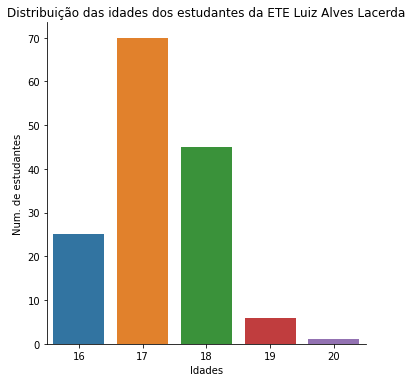
    


```python
g = sns.FacetGrid(micro_ete_lal, col='TP_SEXO')
g.map(sns.histplot, 'NU_IDADE')
```


    <seaborn.axisgrid.FacetGrid at 0x18eb614da60>


    
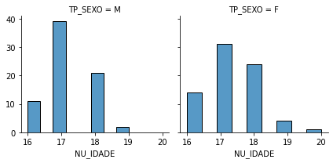
    


```python
mediana_red = micro_ete_lal['NU_NOTA_REDACAO'].median()
mediana_mt = micro_ete_lal['NU_NOTA_MT'].median()
```


```python
plt.figure(figsize=(16,10))
sns.scatterplot(x=micro_ete_lal['NU_NOTA_REDACAO'], y=micro_ete_lal['NU_NOTA_MT'])
plt.axvline(mediana_red, color='red')
plt.axhline(mediana_mt, color='orange')
plt.title('Correlação entre as notas de redação e matemática no Enem 2019 - ETE Luiz Alves Lacerda - Gráfico elaborado por Davidson Santana', fontsize=14)
plt.xlabel('Nota Redação', fontsize=14)
plt.ylabel('Nota Matemática', fontsize=14)
plt.savefig('correlacao_redacao_mt.png', format='png')
```


    
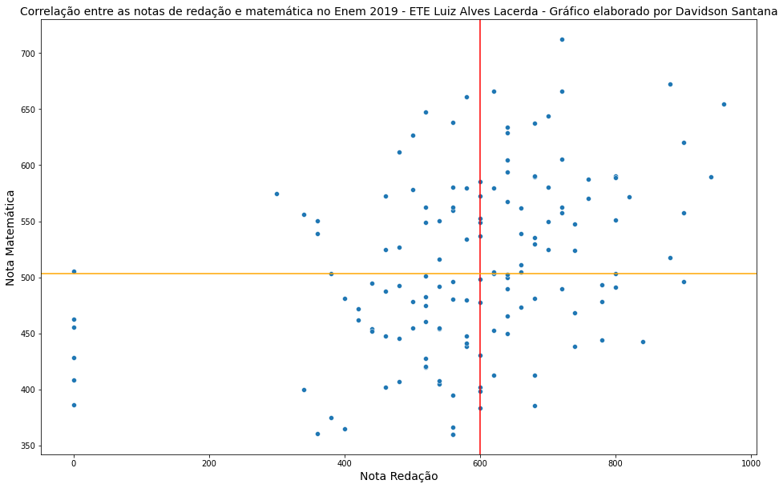
    


```python
plt.figure(figsize=(10,10))
g = sns.FacetGrid(micro_ete_lal, row='TP_SEXO', col='NU_IDADE', margin_titles=True)
g.map(sns.scatterplot, 'NU_NOTA_REDACAO', 'NU_NOTA_MT')
```


    <seaborn.axisgrid.FacetGrid at 0x142957e5220>


    <Figure size 720x720 with 0 Axes>


    
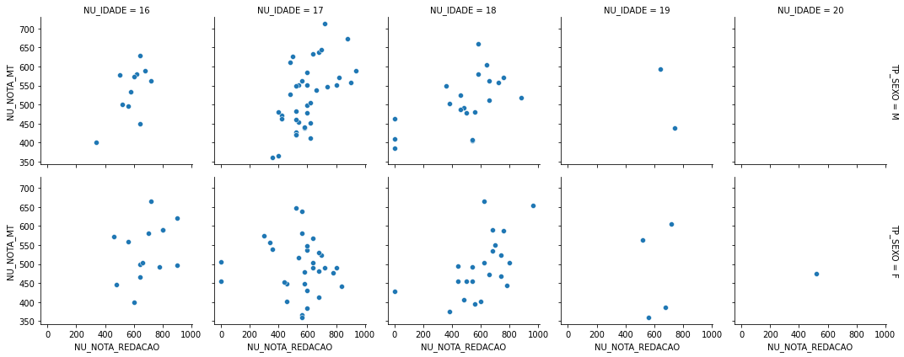
    


```python
micro_ete_lal['NO_MUNICIPIO_RESIDENCIA'].value_counts()
```


    Cabo de Santo Agostinho     111
    Jaboatão dos Guararapes     28
    Recife                        6
    Escada                        1
    Ipojuca                       1
    Name: NO_MUNICIPIO_RESIDENCIA, dtype: int64


```python
plt.figure(figsize=(12,8))
micro_ete_lal['NO_MUNICIPIO_RESIDENCIA'].value_counts().plot.bar()
# sns.catplot(x='NO_MUNICIPIO_RESIDENCIA', kind="count", data=micro_ete_lal[["NU_INSCRICAO","NO_MUNICIPIO_RESIDENCIA"]])
```


    <AxesSubplot:>


    
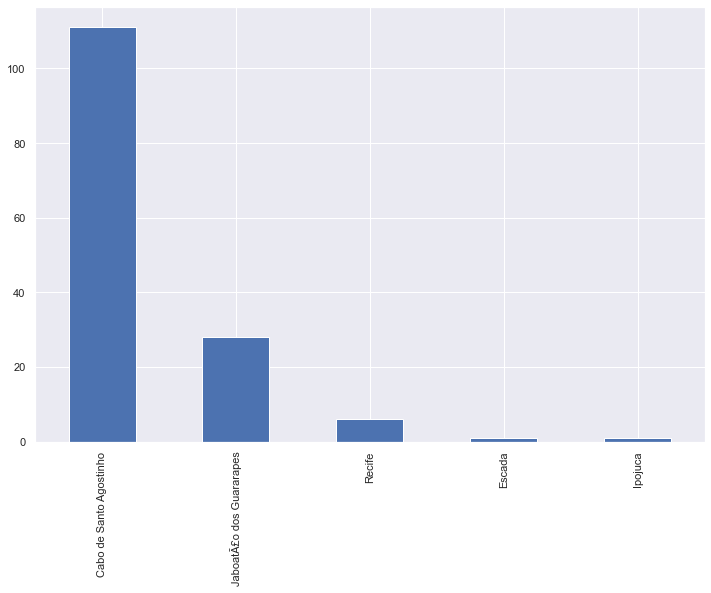
    


## Distribuição das notas de matemática

A maior nota em matemática foi 712,3.


```python
micro_ete_lal['NU_NOTA_MT'].max()
```


    712.3


A menor nota em matemática foi 359,9.


```python
micro_ete_lal['NU_NOTA_MT'].min()
```


    359.9


A nota média foi igual 509,4.


```python
round(micro_ete_lal['NU_NOTA_MT'].mean(),1)
```


    509.4


A nota mediana foi 502,95.


```python
micro_ete_lal['NU_NOTA_MT'].median()
```


    502.95


Resumo das notas de matemática.


```python
micro_ete_lal['NU_NOTA_MT'].describe()
```


    count    142.000000
    mean     509.389437
    std       78.439195
    min      359.900000
    25%      452.900000
    50%      502.950000
    75%      566.500000
    max      712.300000
    Name: NU_NOTA_MT, dtype: float64


### Distribuição gráfica das notas


```python
sns.axes_style()
```


    {'axes.facecolor': 'white',
     'axes.edgecolor': 'black',
     'axes.grid': False,
     'axes.axisbelow': 'line',
     'axes.labelcolor': 'black',
     'figure.facecolor': (1, 1, 1, 0),
     'grid.color': '#b0b0b0',
     'grid.linestyle': '-',
     'text.color': 'black',
     'xtick.color': 'black',
     'ytick.color': 'black',
     'xtick.direction': 'out',
     'ytick.direction': 'out',
     'lines.solid_capstyle': <CapStyle.projecting: 'projecting'>,
     'patch.edgecolor': 'black',
     'patch.force_edgecolor': False,
     'image.cmap': 'viridis',
     'font.family': ['sans-serif'],
     'font.sans-serif': ['DejaVu Sans',
      'Bitstream Vera Sans',
      'Computer Modern Sans Serif',
      'Lucida Grande',
      'Verdana',
      'Geneva',
      'Lucid',
      'Arial',
      'Helvetica',
      'Avant Garde',
      'sans-serif'],
     'xtick.bottom': True,
     'xtick.top': False,
     'ytick.left': True,
     'ytick.right': False,
     'axes.spines.left': True,
     'axes.spines.bottom': True,
     'axes.spines.right': True,
     'axes.spines.top': True}


```python
plt.figure(figsize=(12,8))
sns.set_theme()
sns.histplot(data=micro_ete_lal, x="NU_NOTA_MT", label=True)
plt.axvline(mediana_mt, color='orange')
plt.title("Distribuição das notas de Matemática da ETE Luiz Alves Lacerda - ENEM 2019", fontsize=14)
plt.xlabel("Notas de Matemática", fontsize=14)
plt.ylabel('Número de estudantes', fontsize=14)
plt.savefig('distribuicao_notas_mt_enem_2019.png', format='png')
# sns.axes_style(axes.grid=True)
```


    
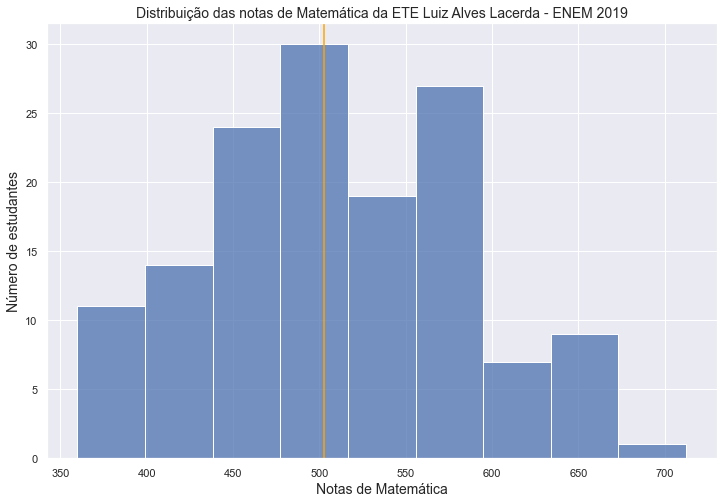
    


## Distribuição das notas de redação

A maior nota em redação foi


```python
micro_ete_lal['NU_NOTA_REDACAO'].max()
```


    960.0


A menor nota em redação foi


```python
micro_ete_lal['NU_NOTA_REDACAO'].min()
```


    0.0


A nota média em redação foi


```python
round(micro_ete_lal['NU_NOTA_REDACAO'].mean(),2)
```


    581.27


A nota mediana em redação foi


```python
micro_ete_lal['NU_NOTA_REDACAO'].median()
```


    600.0


Resumo das notas em redação


```python
micro_ete_lal['NU_NOTA_REDACAO'].describe()
```


    count    142.000000
    mean     581.267606
    std      179.900915
    min        0.000000
    25%      520.000000
    50%      600.000000
    75%      680.000000
    max      960.000000
    Name: NU_NOTA_REDACAO, dtype: float64


```python
plt.figure(figsize=(12,8))
micro_ete_lal['NU_NOTA_REDACAO'].value_counts().plot.barh()
```


    <AxesSubplot:>


    
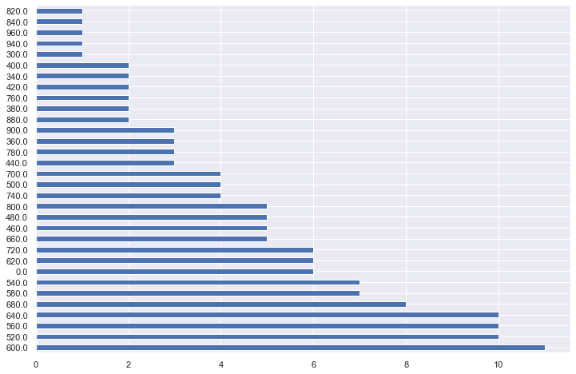
    


### Distribuição gráfica das notas em redação


```python
plt.figure(figsize=(12,8))
sns.set_theme()
sns.histplot(data=micro_ete_lal, x="NU_NOTA_REDACAO", bins=9)
plt.axvline(mediana_red, color='orange')
plt.title("Distribuição das notas de Redação da ETE Luiz Alves Lacerda - ENEM 2019", fontsize=14)
plt.xlabel("Notas de Redação", fontsize=14)
plt.ylabel('Número de estudantes', fontsize=14)
plt.savefig('distribuicao_notas_redacao_enem_2019.png', format='png')
```


    
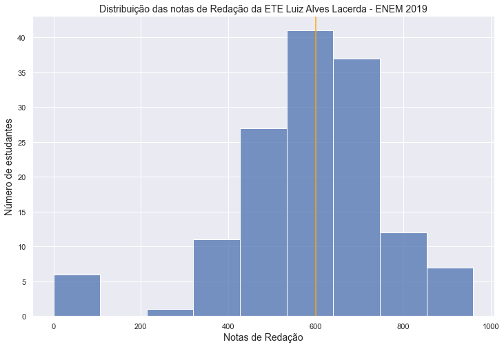
    


```python

```
